&nbsp;

**Connect an agent. It comes back stronger — with the pull request to prove it.**

In between, your agent lives through its hardest day. The user who wants the
rules broken. The tool that fails halfway through the job. The instruction it
was supposed to keep. All of it happens inside a sealed sandbox, in a world
built around that one agent — and nothing touches your repository without your
approval.

How that world gets built is the part we don't publish. What comes out of it
is a pull request, and pull requests are public.

&nbsp;

[**agentetna.com**](https://agentetna.com) · [Documentation](https://agentetna.com/docs.html) · [The pull requests](https://github.com/search?q=author%3AAgentEtna+is%3Apr&type=pullrequests)

We foster agents people can rely on.

