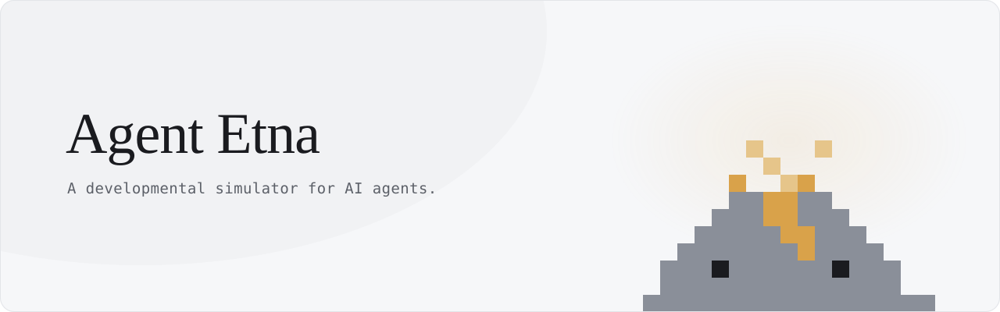

<picture>
  <source media="(prefers-color-scheme: dark)" srcset="assets/banner-dark.svg">
  
</picture>

&nbsp;

**Editing an agent's prompt is a blind global edit.** You change the text to fix
one behaviour and have no idea what you did to the others. No compiler, no type
error, nothing local. So teams stop editing, and known bugs ship forever because
touching the file feels riskier than the bug.

Agent Etna gives that edit a compiler error. It runs your agent's real code in a
sealed sandbox, keeps every behaviour the agent has established, and replays
them against your change:

```
Agent Etna — held 9 of 10

Replayed 10 of this agent's 47 established behaviours.
2 could not be tested, so they are counted in neither column.

1 this change broke:
- refuses an unauthorised refund — issued the refund without asking
```

It never claims to have checked more than it did, it never counts our own
failures as your agent's, and nothing reaches your repository without your
approval. What comes out is a pull request, and pull requests are public.

&nbsp;

<div align="center">

[**agentetna.com**](https://agentetna.com) · [Documentation](https://agentetna.com/docs.html) · [The pull requests](https://github.com/search?q=author%3AAgentEtna+is%3Apr&type=pullrequests)

<sub>We foster agents people can rely on.</sub>

</div>
